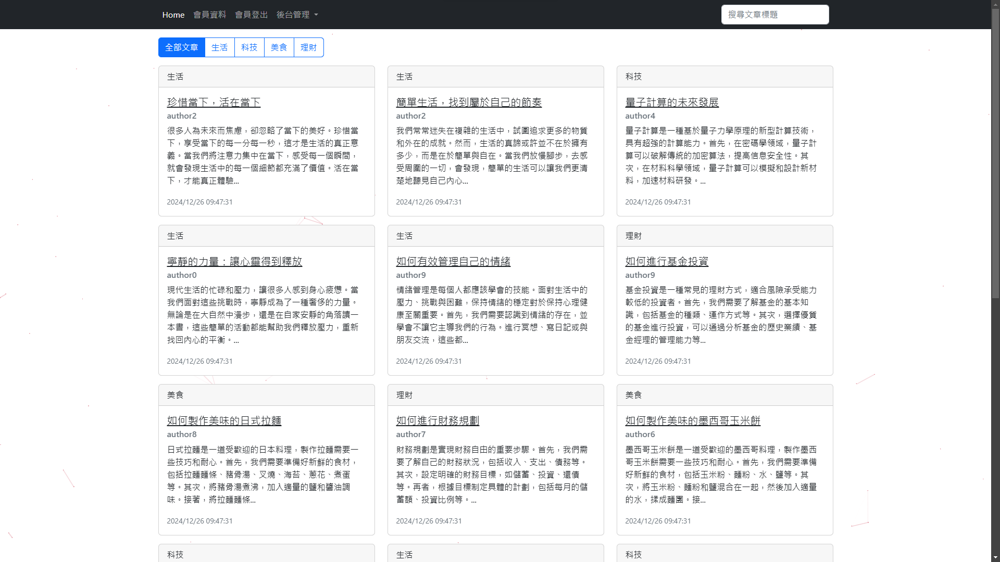
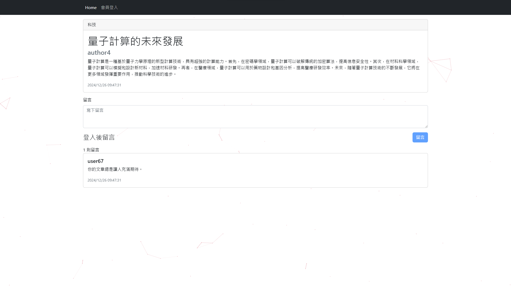
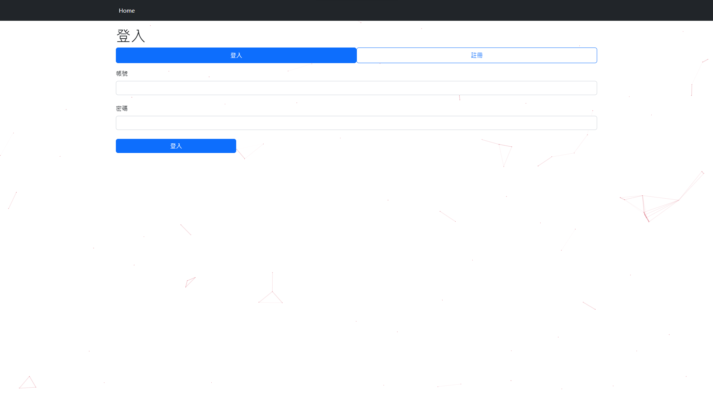
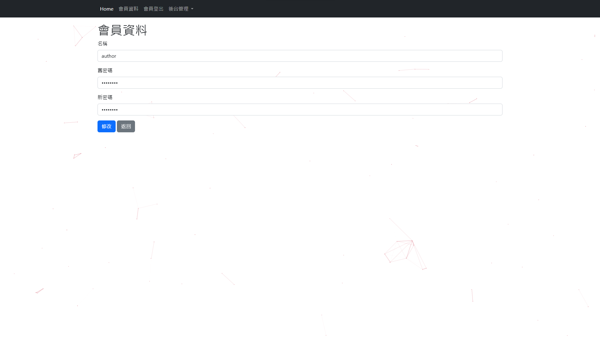
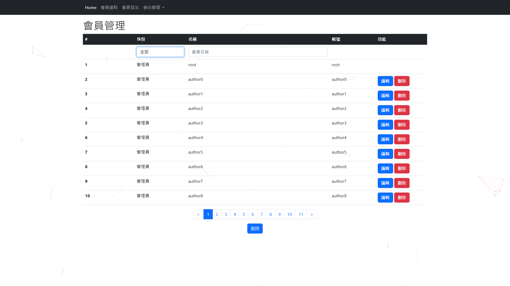
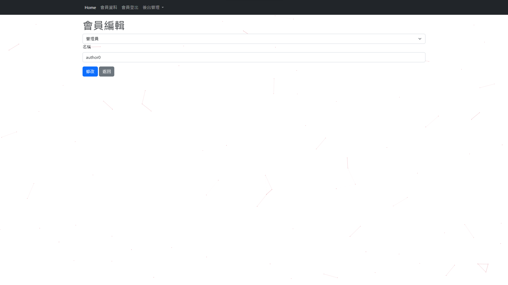
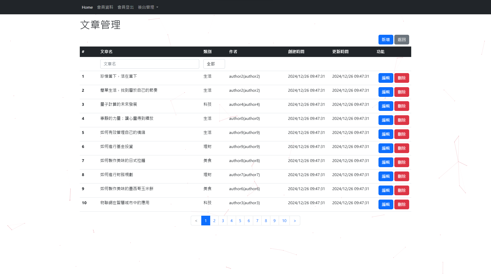
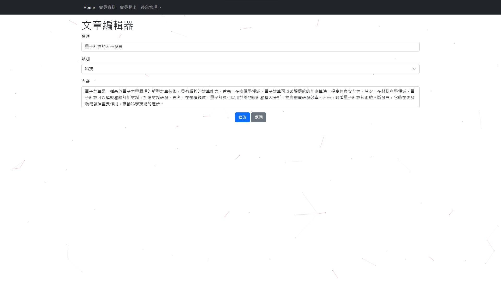

# Blog

This is our final project for the Database course at NCHU, Fall 2024. We built a simple blog system using Node.js, Express, and MySQL. 

Authors can publish articles, and readers can read and comment on them. 
The system also supports user registration and login, and administrators can manage users and articles.



## App Screenshot

<table>
    <tbody>
        <tr>
            <td width="50%" align="center" valign="middle">Home</td>
            <td width="50%" align="center" valign="middle">Article</td>
        </tr>
        <tr></tr>
        <tr>
            <td width="50%" align="center" valign="middle">
                
            </td>
            <td width="50%" align="center" valign="middle">
                
            </td>
        </tr>
        <tr></tr>
        <tr>
            <td width="50%" align="center" valign="middle">Register and Login</td>
            <td width="50%" align="center" valign="middle">User Information</td>
        </tr>
        <tr></tr>
        <tr>
            <td width="50%" align="center" valign="middle">
                
            </td>
            <td width="50%" align="center" valign="middle">
                
            </td>
        </tr>
        <tr></tr>
        <tr>
            <td width="50%" align="center" valign="middle">User Management</td>
            <td width="50%" align="center" valign="middle">User Editor</td>
        </tr>
        <tr></tr>
        <tr>
            <td width="50%" align="center" valign="middle">
                
            </td>
            <td width="50%" align="center" valign="middle">
                
            </td>
        </tr>
        <tr></tr>
        <tr>
            <td width="50%" align="center" valign="middle">Article Management</td>
            <td width="50%" align="center" valign="middle">Article Editor</td>
        </tr>
        <tr></tr>
        <tr>
            <td width="50%" align="center" valign="middle">
                
            </td>
            <td width="50%" align="center" valign="middle">
                
            </td>
        </tr>
    </tbody>
</table>

## How to run this project

1. Install dependencies:
    ```bash
    npm install
    ```

2. Run the database using Docker:
    ```bash
    docker compose -f ./docker-services/docker-compose.yml up -d
    ```

3. Rename the file `.env.example` to `.env`. 
    - This file contains the token secret used to sign the JWTs.
    - You should generate a new secret and replace the value of the `TOKEN_SECRET` and `COOKIE_KEY`.

4. Generate fake data:
    ```bash
    node ./fake.js
    ```

5. Run the app:
    - On MacOS or Linux:
        ```bash
        DEBUG=blog:* npm start
        ```

    - On Windows Command Prompt:
        ```cmd
        set DEBUG=blog:* & npm start
        ```

    - On Windows PowerShell:
        ```powershell
        $env:DEBUG='blog:*'; npm start
        ```

## Acknowledgements
- Special thanks to **Jason Lin**, our instructor, for his guidance, valuable feedback, and support throughout the development of this project.
- Library:
  - [Bootstrap](https://getbootstrap.com/)
- Packages:
  - [Express.js](https://expressjs.com/)
  - [TWIG](https://github.com/twigjs/twig.js)
  - [MySQL2](https://github.com/sidorares/node-mysql2)
  - [argon2](https://github.com/ranisalt/node-argon2)
- Tools:
  - [Docker](https://www.docker.com/)
- Database:
  - [MySQL](https://www.mysql.com/)
  - [Adminer](https://www.adminer.org/)
- Dataset:
  - The articles and comments are generated using the [Github Copilot](https://github.com/features/copilot) and [ChatGPT](https://chatgpt.com).

## Contributors
- HsiangYi Tsai. [devilhyt](https://github.com/devilhyt) on Github.
- Wayne Wu. [Wayne](https://github.com/GalaGala1009) on Github.
- ChiHung YANG. [Young](https://github.com/YANGCHIHUNG) on Github.